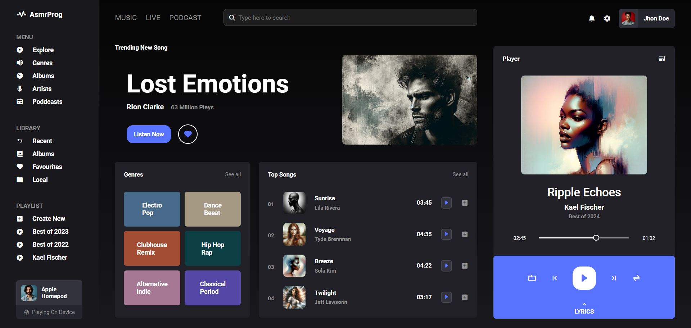

# Responsive-Music-Website
Responsive Music Website Design
In this tutorial, I'll show you how to code a fully responsive music app design with a cool color theme from modern HTML and CSS. We used CSS Flexbox, Media Queries for our design and CSS for some cool animation effects. We even have a sidebar for that! This project has sidebar, music player, header, genres and top music sections!

